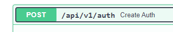
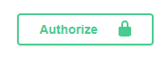
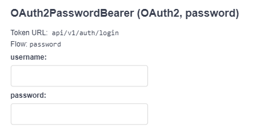

<h1 align="center">Test for Entrix selective process</h1>

# ✅ Project Description

A backend API with FastAPI and PostgreSQL that allows customers and accounts management for bank employees.

# ✅ How to run the application

You can run this application with docker, just clone the repository and run:


```bash
  docker compose up
```

Docker will then create two containers, one for running the application and another for running the PostgreSQL database.

# ✅ Docs

You can access the swagger documentation on localhost:8000/docs

# First steps

1 - Your first step is to create a auth user since most routes are protected by it.



2 - Next you can click on the Authorize button:



3 - Insert your credentials here and click on the Authorize button:



4 - You are all set; now you can try the routes.


# ✅ Project Status

<h3 align="center">
    🚀 Concluded 🚀
</h3>

# 🖥️ Dev

- Made with ❤️ by [Lucas Gasque](https://www.linkedin.com/in/lucasgasque/)
